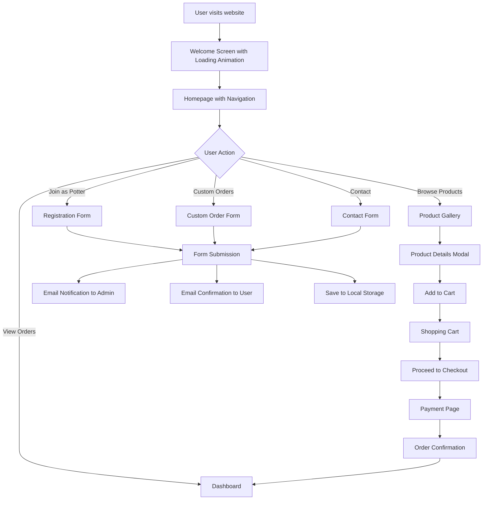

# Kumbhar Bazar - Pottery Marketplace

A modern online marketplace connecting traditional potters with customers who appreciate authentic handmade pottery.

## Flowchart



## Project Overview

Kumbhar Bazar is a comprehensive online marketplace designed to bridge the gap between traditional pottery artisans and modern consumers. The platform showcases authentic handmade pottery while providing a seamless shopping experience with features like product browsing, custom orders, and secure payments.

## Project Structure

```
Kumbhar_Bzar/
├── .github/
│   └── workflows/
│       └── static.yml          # GitHub Pages deployment workflow
├── src/                        # Source code directory
│   ├── assets/                 # Static assets
│   │   ├── css/                # Stylesheets
│   │   │   └── styles.css      # Main stylesheet with pottery-themed design
│   │   └── images/             # All image assets for products and UI
│   ├── components/             # Reusable UI components (future expansion)
│   ├── pages/                  # Individual page files
│   │   ├── dashboard.html      # User dashboard for order tracking
│   │   ├── form.html           # Contact form page
│   │   └── payment.html        # Payment processing page
│   └── services/               # Backend and JavaScript services
│       └── js/                 # JavaScript files
│           ├── script.js       # Main client-side JavaScript for interactivity
│           ├── server.js       # Express server for handling form submissions
│           └── simple-server.js# Simple HTTP server for development
├── .dockerignore               # Docker ignore file
├── .gitignore                  # Git ignore file
├── index.html                  # Main landing page
├── package.json                # Node.js dependencies and scripts
├── package-lock.json           # Locked dependency versions
├── start_server.bat            # Windows batch file to start server
├── README.md                   # Project documentation
├── dependencies.md             # Detailed dependency documentation
└── LICENSE                     # MIT License file
```

## Key Features

### 1. Interactive User Experience
- **Welcome Screen**: Animated loading screen with pottery-themed visuals
- **Responsive Design**: Fully responsive layout that works on all devices
- **Theme Customization**: Multiple pottery-inspired themes (Earth, Ocean, Sunset, Forest, Royal)
- **Interactive Elements**: Hover effects, animations, and smooth transitions

### 2. Product Showcase
- **Product Gallery**: Display of various pottery items with images and pricing
- **Product Details**: Modal view with detailed product information
- **Shopping Cart**: Add/remove items with real-time cart updates

### 3. User Registration
- **Potter Registration**: Form for artisans to join the platform
- **Custom Orders**: Request specific pottery pieces with custom requirements
- **Contact Form**: General inquiries and support requests

### 4. Order Management
- **Dashboard**: View past orders and their status
- **Order Tracking**: Real-time updates on order progress
- **Local Storage**: Persistent cart and order data

### 5. Payment Processing
- **Secure Checkout**: Multi-step payment form with validation
- **Order Summary**: Detailed breakdown of items and costs
- **Order Confirmation**: Success notification and redirect to dashboard

### 6. Backend Services
- **Form Handling**: Express.js server for processing contact forms
- **Email Notifications**: Automated emails to both users and administrators
- **Data Storage**: Local file storage for form submissions

## Technical Architecture

### Frontend Technologies
- **HTML5**: Semantic markup for all pages
- **CSS3**: Advanced styling with custom properties and animations
- **JavaScript (ES6+)**: Client-side interactivity and DOM manipulation
- **Font Awesome**: Icon library for UI elements
- **Google Fonts**: Custom typography (Playfair Display, Poppins)

### Backend Technologies
- **Node.js**: JavaScript runtime environment
- **Express.js**: Web framework for handling HTTP requests
- **Nodemailer**: Email sending library for notifications
- **Body-parser**: Middleware for parsing JSON request bodies
- **CORS**: Cross-origin resource sharing middleware
- **Dotenv**: Environment variable management

### Development Tools
- **Nodemon**: Development server with automatic restart
- **GitHub Actions**: CI/CD for deployment to GitHub Pages
- **Batch Script**: Windows-friendly server startup

## Detailed Workflow Explanation

### 1. User Journey
1. **Initial Visit**: Users are greeted with an animated welcome screen that introduces the brand
2. **Homepage Navigation**: Main navigation allows access to products, registration, custom orders, and contact
3. **Product Browsing**: Users can browse the gallery of pottery items with images and pricing
4. **Product Interaction**: Clicking on items opens a detailed modal view
5. **Shopping Experience**: Add items to cart with real-time count updates
6. **Checkout Process**: Multi-step form for shipping and payment information
7. **Order Completion**: Payment processing with confirmation and order tracking

### 2. Potter Registration
1. **Form Access**: Potters can access the registration form through the "Join Us" navigation
2. **Information Collection**: Full name, email, phone, location, and experience details
3. **Portfolio Upload**: Option to upload images of their work
4. **Submission**: Form data is sent to the backend server for processing

### 3. Custom Orders
1. **Requirement Specification**: Users select product type and provide detailed requirements
2. **Customization Options**: Size, description, budget, and timeline specifications
3. **Matching Process**: System connects users with appropriate artisans
4. **Order Tracking**: Custom orders are tracked separately in the dashboard

### 4. Backend Processing
1. **Form Validation**: Server-side validation of all form submissions
2. **Data Storage**: Form submissions are saved as JSON files locally
3. **Email Notifications**: Automated emails sent to both users and administrators
4. **Error Handling**: Comprehensive error handling and user feedback

## Getting Started

### Prerequisites
- Node.js (v14 or higher)
- npm (comes with Node.js)

### Installation
1. Clone the repository:
   ```bash
   git clone https://github.com/kunal4060/Kumbhar_Bzar.git
   ```

2. Navigate to the project directory:
   ```bash
   cd Kumbhar_Bzar
   ```

3. Install dependencies:
   ```bash
   npm install
   ```

4. Create a `.env` file with your email credentials:
   ```
   EMAIL_USER=your_email@gmail.com
   EMAIL_PASS=your_app_password
   ```

### Running the Application

#### Development Mode
```bash
npm run dev
```

#### Production Mode
```bash
npm start
```

#### Windows Users
Simply run the `start_server.bat` file.

### Accessing the Application
Open your browser and visit `http://localhost:3000`

## Deployment

The application is configured for deployment to GitHub Pages using GitHub Actions. Any push to the `main` branch will automatically trigger the deployment workflow.

## Project Organization Summary

This project has been organized with a clear directory structure to improve maintainability and scalability:

1. **Structured Directory Organization**: Files organized into logical directories (assets, pages, services) for better maintainability
2. **Updated File References**: All HTML files updated with correct relative paths to reflect new directory structure
3. **Comprehensive Documentation**: Detailed README with flowchart, project overview, and usage instructions
4. **Complete Project Structure Documentation**: Separate PROJECT_STRUCTURE.md file for detailed directory information
5. **License File**: Added MIT License for proper open-source licensing

## Contributing

Contributions are welcome! Please feel free to submit a Pull Request.

1. Fork the repository
2. Create your feature branch (`git checkout -b feature/AmazingFeature`)
3. Commit your changes (`git commit -m 'Add some AmazingFeature'`)
4. Push to the branch (`git push origin feature/AmazingFeature`)
5. Open a Pull Request

## License

This project is licensed under the MIT License - see the [LICENSE](LICENSE) file for details.

## Support

For support, email kumbharbazar@gmail.com or open an issue in the repository.